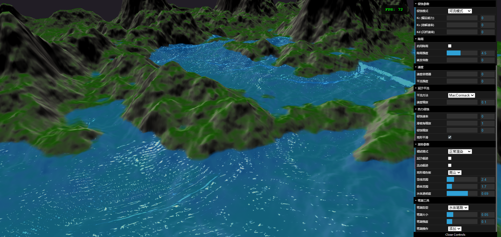
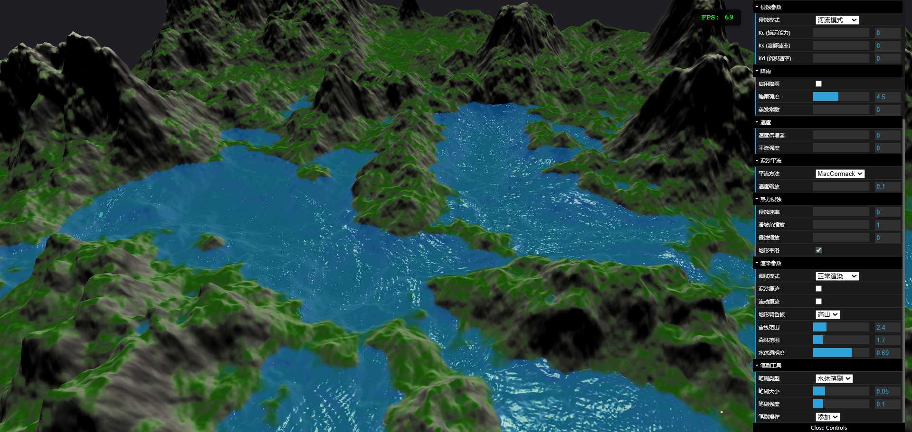
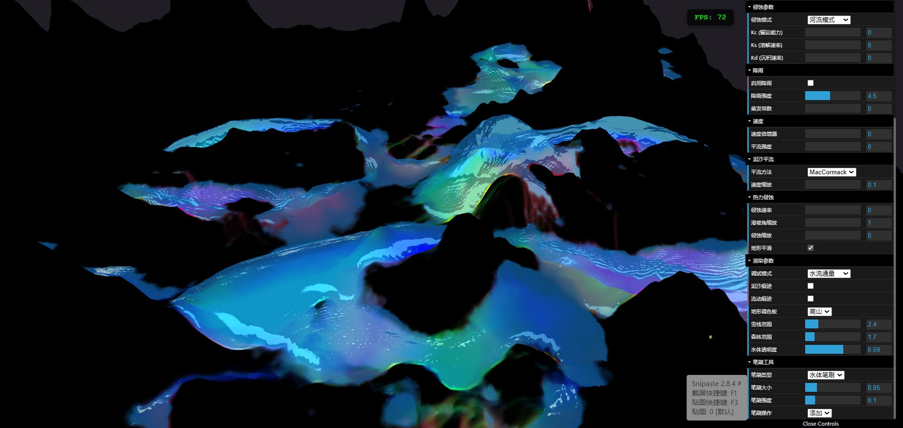
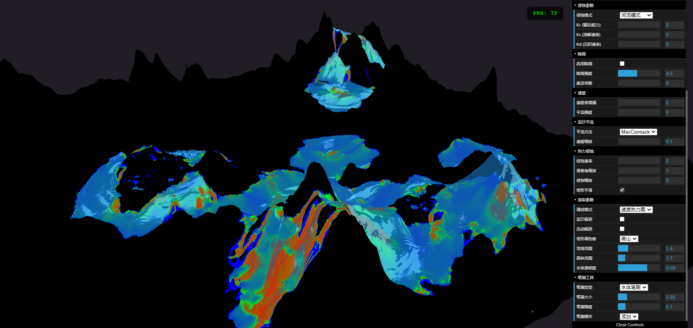

# Three.js Terrain Erosion Simulation

基于 Three.js 和 WebGL2 的实时地形侵蚀模拟，从原版 WebGL 项目迁移重构而来。

## 原版项目

本项目基于 [Webgl-Erosion](https://github.com/lanlou123/Webgl-Erosion) 迁移重构，使用 Three.js 替代原生 WebGL 实现，采用 TypeScript 重写，提升代码可维护性和开发体验。

## 演示截图









## 主要特性

- 基于管道模型的水力侵蚀模拟
- 热力侵蚀（滑坡）模拟
- 泥沙输运与沉积
- MacCormack 平流方案
- 实时笔刷编辑（地形/水体）
- 多种地形生成模式（FBM、域扭曲、梯田、Voronoi）
- 多种调试视图（泥沙、速度场、通量等）

## 技术栈

- Three.js + WebGL2
- TypeScript
- Vite
- dat.GUI

## 快速开始

```bash
# 安装依赖
npm install

# 启动开发服务器
npm run dev

# 构建生产版本
npm run build
```

## 操作说明

- 鼠标左键拖拽：旋转视角
- 鼠标右键拖拽：平移视角
- 鼠标滚轮：缩放
- 按住 Shift + 左键：笔刷绘制
- GUI 面板：调整模拟参数

## 参考文献

- [Fast Hydraulic Erosion Simulation and Visualization on GPU](http://www-ljk.imag.fr/Publications/Basilic/com.lmc.publi.PUBLI_Inproceedings@117681e94b6_fff75c/FastErosion_PG07.pdf)
- [Interactive Terrain Modeling Using Hydraulic Erosion](https://cgg.mff.cuni.cz/~jaroslav/papers/2008-sca-erosim/2008-sca-erosiom-fin.pdf)
- ShaderX7 Advanced Rendering Techniques

## License

MIT
